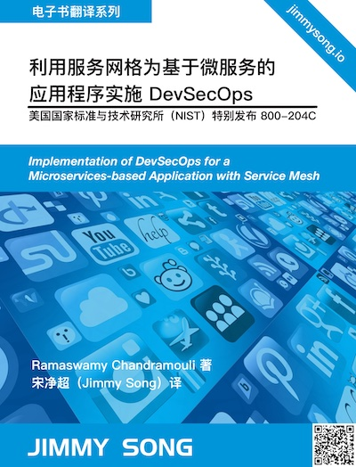

# 利用服务网格为基于微服务的应用程序实施 DevSecOps

本书译自美国国家标准标准与技术研究院（NIST）特别发布 800-204C，译者 [Jimmy Song](https://jimmysong.io)。

  

## 关于本书

作者：Ramaswamy Chandramouli

计算机安全司信息技术实验室

美国商务部

Gina M. Raimondo，秘书

国家标准和技术研究所

James K. Olthoff，履行负责标准和技术的商务部副部长兼国家标准和技术研究所所长的非专属职能和职责

本出版物可在：<https://doi.org/10.6028/NIST.SP.800-204C> 免费获取。
