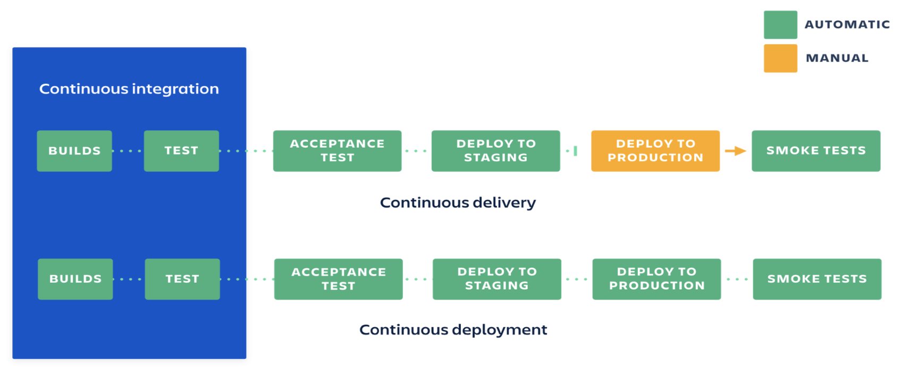

# 3.3 DevSecOps 关键原语和实施任务

所涉及的关键原语和实施任务是。

-   管道和 CI/CD 管道的概念
-   CI/CD 管道的构建块
-   设计和执行 CI/CD 管道
-   自动化的战略
-   CI/CD 管道中对安全自动化工具的要求

## 3.3.1 管道的概念和 CI/CD 管道

DevSecOps 作为一种敏捷应用开发、部署和运维的方法论或框架，与其他方法论一样，是由 [各个阶段](https://www.redhat.com/en/topics/devops/what-is-devsecops) 组成的。信息在各阶段中的顺序和流动被称为工作流，其中一些阶段可以平行执行，而其他阶段则必须遵循一个顺序。每个阶段可能需要调用一个独特的工作来执行该阶段的活动。

DevSecOps 在流程工作流中引入的一个独特概念是 **[管道](https://www.redhat.com/en/topics/devops/what-is-ci-cd#:%7E:text=CI%2FCD%20is%20a%20method,continuous%20delivery%2C%20and%20continuous%20deployment)**
的概念。有了管道，就不需要为启动 / 执行流程的每个阶段单独编写作业。相反，只有一个作业从初始阶段开始，自动触发与其他阶段有关的活动 / 任务（包括顺序的和并行的），并创建一个无错误的智能工作流程。

DevSecOps 中的管道被称为 CI/CD 管道，这是基于它所完成的总体任务和它所包含的两个单独阶段。CD 可以表示持续交付或持续部署阶段。根据这后一个阶段，CI/CD 可以涉及以下任务：

-   构建、测试、安全和交付：经过测试的修改后的代码被交付到暂存区。
-   构建、测试、安全、交付和部署：暂存区的代码会自动部署。

在前者中，自动化在交付阶段就结束了，接下来在托管平台基础设施中部署修改后的应用程序的任务是手动执行的。在后者中，部署也是自动化的。管道中任何阶段的自动化都可以通过将管道阶段表达为代码的工具来实现。

CI/CD 管道的工作流程如下图 1 所示。

图中所示的单元和集成测试使用了第 3.2 节中描述的 SAST、DAST 和 SCA 工具。应该注意的是，当测试失败时，组织可以选择继续构建过程。根据组织如何平衡风险容忍度和业务需求，当一个特定的测试失败时，它可以选择 fail-open（记录并继续）或 fail-closed（停止 / 中断）。在失败关闭的情况下，开发人员得到测试结果报告，必须修复问题，并重新启动 CI 过程。

持续集成涉及到开发人员经常将代码变化合并到一个中央存储库中，在那里运行自动化的构建和测试。构建是将源代码转换为可执行代码的过程，以便在其上运行的平台。在 CI/CD 管道软件中，开发者的修改是通过创建构建和运行针对构建的自动测试来验证的。这个过程避免了在等待发布日将修改合并到发布分支时可能发生的 [集成挑战](https://www.atlassian.com/continuous-delivery/principles/continuous-integration-vs-delivery-vs-deployment)。

持续交付是持续集成之后的一个阶段，在这个阶段，代码的变化在构建阶段之后被部署到测试和 / 或暂存环境。持续交付到生产环境包括指定一个发布频率 —— 每天、每周、每两周或其他时期 —— 基于软件的性质或组织运营的市场。这意味着在自动化测试的基础上，有一个预定的发布过程，尽管应用程序可以通过点击一个按钮在任何时候被部署。持续交付中的部署过程的特点是手动，但诸如代码迁移到生产服务器、建立网络参数和指定运行时配置数据等任务可以由自动化脚本来完成。

持续部署类似于持续交付，只是发布是 [自动进行](https://www.atlassian.com/continuous-delivery/principles/continuous-integration-vs-delivery-vs-deployment) 的，代码的修改在完成后立即提供给客户。自动发布过程在很多情况下可能包括 A/B 测试，以促进新功能的缓慢上线，以便在出现错误 / 误差时减轻失败的影响。

持续交付和持续部署之间的区别如图 2 中所示。

## 3.3.2 CI/CD 管道的构建块

定义 CI/CD 管道资源、构建管道和执行这些管道的主要软件是 CI/CD 管道软件。这类软件的架构可能有轻微的变化，取决于特定的产品。以下是对 CI/CD 工具（管道软件）运行情况的概述：

-   一些 CI/CD 工具在应用程序和相关资源托管的平台上自然运行（即容器编排和资源管理平台），而其他工具需要通过其 API 集成到应用程序托管平台。使用应用托管平台原生的 CI/CD 工具的一些优势是：
    -   它使部署、维护和管理 CI/CD 工具本身更加容易。
    -   CI/CD 工具定义的每个管道都成为另一个平台原生资源，并以同样的方式管理。事实上，执行管道所需的所有实体，如任务和管道（然后分别作为其他实体的蓝图，如任务运行和管道运行），可以作为建立在平台原生资源之上的 [自定义资源定义](https://itnext.io/k8s-native-jenkins-x-and-tekton-pipelines-e2b5a61a1d22)（CRD）来创建。具有这种架构的软件可以被其他 CI/CD 管道软件产品所使用，以促进管道的快速定义。
-   一些 CI/CD 工具与代码库集成，以扫描 / 检查应用程序代码。这些类型的工具与每个应用程序和每个环境的代码库有关联。当应用程序模块、基础设施或配置发生变化时，它们被存储在这些代码库中。通过 webhooks 或其他方式连接到代码库的 CI/CD 管道软件在提交时被激活（推送工作流模型）或通过来自这些存储库的拉取请求。
-   一些 CI/CD 工具单独为本地平台执行 CD 功能（例如，Kubernetes 平台的 Jenkins X）或为多个技术栈执行 CD 功能（例如，多云部署的 Spinnaker）。这类工具的困难在于，它们可能缺乏完成 CI 功能的本地工具（例如，测试代码的工具，构建应用镜像，或将其推送到注册中心）。

## 3.3.3 准备和执行 CI/CD 管道

创建 CI/CD 管道的目的是为了实现源代码的频繁更新、重建，以及将更新的模块自动部署到生产环境中。

涉及的 [关键任务](https://aws.amazon.com/getting-started/hands-on/create-continuous-delivery-pipeline/?trk=gs_card) 是：

1.  确保 DevSecOps 平台中的所有单个组件（管道软件、SDLC 软件、代码库、可观察性工具等）都可用。
2.  通过认证、验证或定制测试，确保这些组件的安全。
3.  将 CI 和 CD 工具与 SDLC 工具整合起来 —— 访问令牌、调用脚本、管道定义。
4.  根据部署环境（即内部或云端的应用程序托管平台），在 IaC 工具（与 GitOps）中设置配置细节
5.  将运行时工具与部署环境相结合。
6.  设计仪表盘并定义要监控的事件、要生成的警报和要监控的应用程序状态变量（如内存利用率等），通过与日志聚合器、指标生成器和跟踪生成器等工具的连接。

执行任务包括：

-   设置源代码库。建立一个存储库（如 GitHub 或 GitLab），用于存储具有适当版本控制的应用程序源代码。
-   构建过程。使用自动代码构建工具，配置并执行生成可执行文件的构建过程（对于那些需要更新的代码部分）。
-   保证过程的安全。通过使用 SAST 和 DAST 工具进行单元测试，确保构建时没有静态和动态的漏洞。这和上面的任务是由 CI 工具激活的。
-   描述部署环境。这可能涉及描述（使用 IaC）物理 / 虚拟资源，以便在云或企业数据中心部署应用程序。
-   创建交付管道。创建一个将自动部署应用程序的管道。这个任务和前面的任务是由 CD 工具启用的。
-   测试代码并执行管道。在适当的测试之后，只要有新的代码出现在资源库中，就执行 CI 工具。当构建过程成功后，执行 CD 工具，将应用程序部署到暂存 / 生产环境中。
-   激活运行时工具和仪表板，启动运行时监控。

重申一下，CI/CD 流程的三个主要阶段是构建 / 测试、发布 / 打包和部署。以下功能将其转化为一个管道：

-   当一个服务的源代码被更新时，推送到源代码库的代码变化会触发代码构建工具。

-   代码开发环境或代码构建工具（如 IDE），通常与安全测试工具（如静态漏洞分析工具）集成，以促进安全编译代码工件的生成，从而将安全纳入 CI 管道。
-   在代码构建工具中生成的编译代码工件会触发交付 / 打包工具，该工具可能与它自己的一套工具（例如，动态漏洞分析、动态渗透测试工具、用于识别所附库中的漏洞的软件组成分析工具）集成在一起，并且还创建与部署环境有关的配置参数。
-   然后，发布 / 打包工具的输出被自动送入 CD 工具，该工具将软件包部署到 [所需的环境](https://aws.amazon.com/blogs/devops/setting-up-a-ci-cd-pipeline-by-integrating-jenkins-with-aws-codebuild-and-aws-codedeploy/) 中（例如，中转、生产）。

CI/CD 管道的工作流程不应产生无人参与的印象。以下团队 / 角色对 CI/CD 管道做出 [贡献](https://medium.com/@mylocaldevstack/the-future-of-devops-assembly-lines-40227546d750)：

-   开发团队：这个团队的成员为他们的应用程序申报第三方现成软件（OSS）的依赖性，审查 DevSecOps 系统围绕脆弱依赖性提出的建议，按照建议进行更新，并编写足够的测试案例以确保所有功能验证（消除运行时的错误）。
-   首席信息安全官（CISO）：在与安全团队协商后，CISO 定义了 DevSecOps 系统的整体范围（深度和广度），从而可以适当地配置它，以满足应用程序的关键任务需求。
-   安全团队：这个团队的成员按照最佳实践创建管道，包括执行所有必要的安全功能的任务（例如，SBOM 生成、漏洞扫描、代码构建、代码签名、引入新的测试工具、进行审计等）。具体来说，在某些情况下，安全团队的成员可能会负责设计、构建和维护策略即代码和相关管道。
-   基础设施团队：这个团队的成员创建、维护和升级基础设施。
-   QA 团队：这个团队的成员开发集成测试案例。
-   部署团队 / 发布团队：这个团队的成员为各种环境（UAT/PreProd/Prod）创建管道和包，并为这些环境进行适当的配置和供应。

这些团队进行的许多活动中，有一些包括 CI/CD 管道中采用的工具的定制、更新和增强（例如，用最新的已知漏洞数据库更新静态漏洞分析工具）。在手工操作过程中，应谨慎行事，以免阻塞管道。在设定平均生产时间目标的同时，还应通过使用 "合并（GitLab）或拉取（GitHub）请求" 和这些请求的多个批准者来减少风险，如内部威胁。这个管道由发布后团队设计、维护和执行，该团队 —— 除了监控功能 —— 还执行 [其他流程](https://faun.pub/best-terraform-tutorial-guides-an-overview-65a6fcee0a24)，如合规管理、备份流程和资产跟踪。

## 3.3.4 自动化的战略

与其他涉及从编码到发布的线性流程的软件开发模式相比，DevOps 使用了一个具有交付管道的前向过程（即构建 / 安全、交付 / 打包和发布）和一个具有反馈回路的反向过程（即计划和监控），形成一个递归的工作流程。自动化在这些活动中的作用是改善工作流程。持续集成强调测试自动化，以确保每当新的提交被集成到主分支时，应用程序不会被破坏。自动化带来了以下好处：

-   产生有关软件静态和运行时流程的数据。
-   减少开发和部署时间。
-   架构的内置安全、隐私和合规性。

以下是推荐的 [自动化策略](https://medium.com/searce/gitops-the-next-big-thing-for-devops-and-automation-2a9597e51559)，以便于更好地利用组织资源，并在高效、安全的应用环境方面获得最大利益。

选择要自动化的活动。例如，以下是测试活动自动化的有效候选项目：

-   测试其功能需符合法规要求的模块（如 PCI-DSS、HIPAA、Sarbanes-Oxley）。
-   具有中度至高度重复性的任务。
-   测试执行时间序列操作的模块，如消息发布者和消息订阅者。
-   测试涉及跨越多个服务的事务的工作流程（例如，请求跟踪）。
-   测试那些资源密集型和可能成为性能瓶颈的服务。

在根据上述标准选择自动化的候选者后，必须应用通常的风险分析来选择一个子集，以提供最佳的回报，并使理想的安全指标（如深度防御）最大化。一些推荐的策略包括：

-   使用每年节省的小时数的成本效益比来确定哪些 [流程](https://medium.com/searce/gitops-the-next-big-thing-for-devops-and-automation-2a9597e51559) 需要自动化的优先次序。
-   使用 [关键绩效指标（KPI）](https://searchitoperations.techtarget.com/feature/Understand-the-role-of-infrastructure-as-code-in-DevOps?utm_campaign=20210809_The+next+DevSecOps+challenge%3A+People&utm_medium=EM&utm_source=NLN&track=NL-1841&ad=939963&asrc=EM_NLN_174809933)（例如，识别故障或问题、纠正或恢复的平均时间）作为标记来完善 DevSecOps 流程。
-   根据应用，对基础设施服务应用不同的权重（例如，授权和其他策略的执行，监测系统状态以确保安全运行状态，在系统可用性、延迟、从中断中恢复的平均时间等方面的网络弹性），以确定对 DevSecOps 流程的资源分配。

## 3.3.5 CI/CD 管道中对安全自动化工具的要求

在 CI/CD 管道中使用的各种功能（如静态漏洞分析、动态漏洞分析、软件构成分析）的安全自动化工具需要有不同的接口和警报 / 报告要求，因为它们必须根据使用管道阶段（如构建、打包、发布）而无缝运行。这些要求是：

-   安全自动化工具应与集成开发环境（IDE）工具一起工作，并帮助开发人员优先处理和补救静态漏洞。需要这些功能来促进开发人员的采用和提高生产力。
-   安全自动化工具应该是灵活的，以支持特定的工作流程，并为安全服务提供扩展能力。
-   在构建阶段进行静态漏洞检查的工具确保了数据流的安全，而那些进行动态漏洞检查的工具则确保了运行时应用程序状态的安全。

必须提到的是，安全自动化工具是有成本的，因此，这些工具的使用程度是基于风险因素分析。